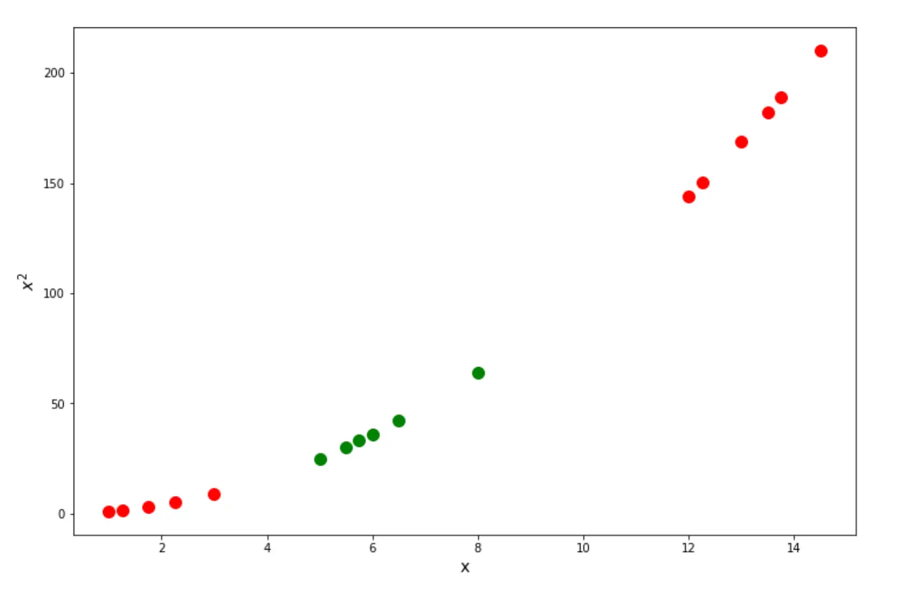
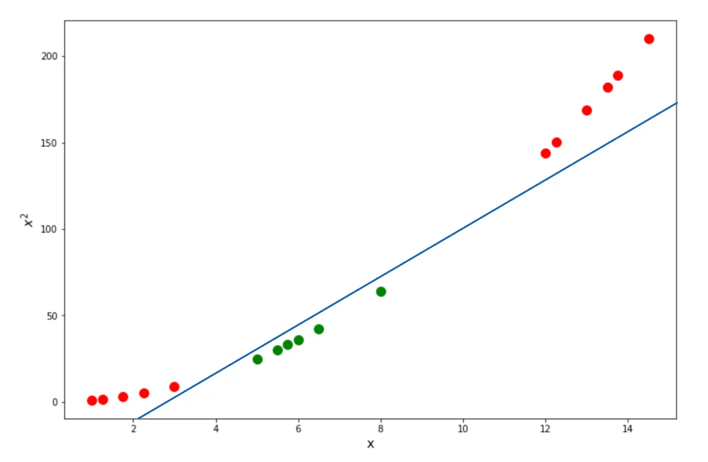
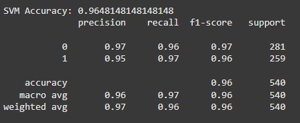
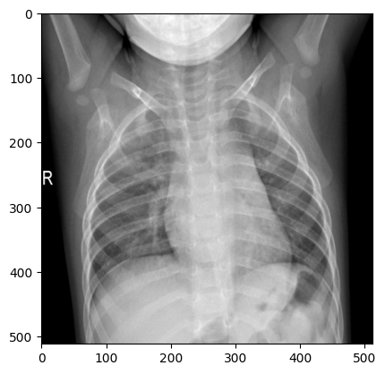
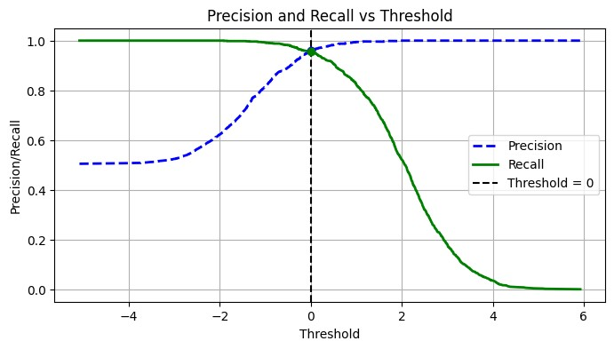
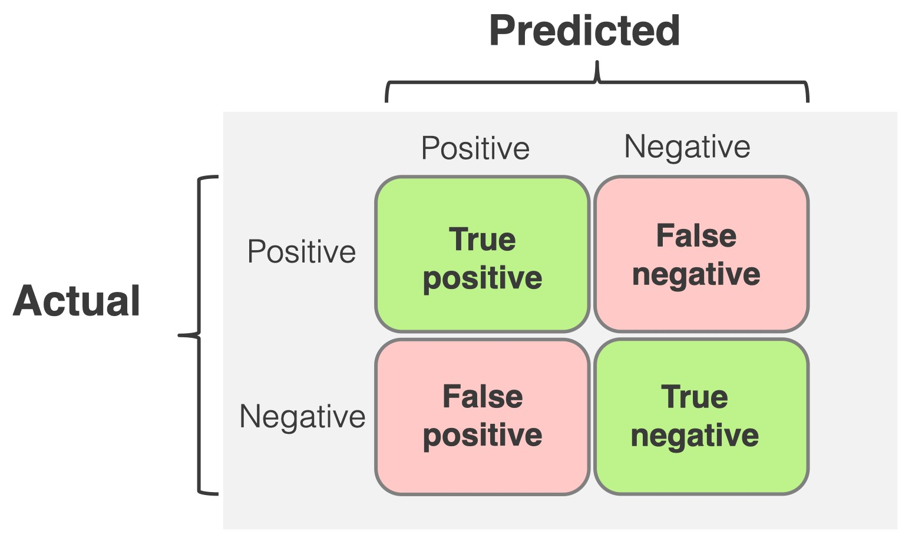
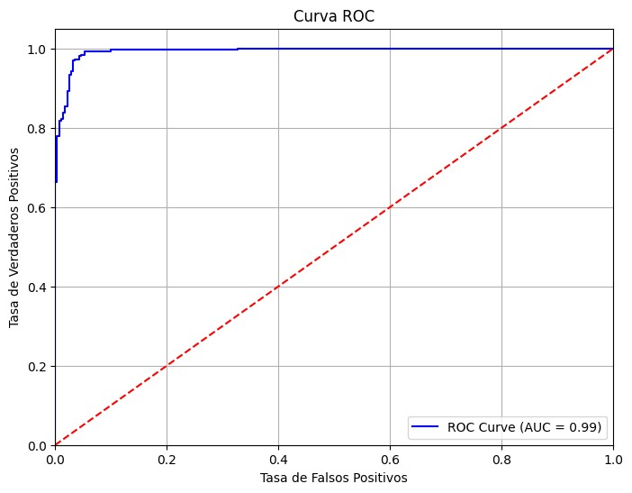

# Documentación del Modelo de IA para Diagnóstico Médico

---

## Introducción

Este proyecto tiene como objetivo desarrollar una aplicación de inteligencia artificial para realizar diagnósticos médicos a través de imágenes de rayos X del torso. La aplicación web (MEDILAB) utiliza un modelo de IA entrenado específicamente para analizar estas imágenes y determinar si un paciente se encuentra en estado normal o si presenta signos de de alguna enfermedad. Este modelo en particular está entrenado para clasificar personas en estado de salud **normal** y personas con **neumonía**.

El modelo de IA fue entrenado utilizando un **Support Vector Machine (SVM)** con kernel lineal, el cual es adecuado para este tipo de clasificación binaria. La elección de un SVM permite que el modelo encuentre un hiperplano que maximice la separación entre las clases normal y neumonía, asegurando así un diagnóstico preciso. El modelo fue configurado con `probability=True` para obtener no solo la predicción de clase, sino también la probabilidad asociada a cada predicción, lo cual es crucial para proporcionar un nivel de confianza en los diagnósticos.

A lo largo del desarrollo de este proyecto, se realizaron múltiples análisis y evaluaciones para asegurar la precisión y la confiabilidad del modelo. La documentación detalla los pasos y decisiones clave en el proceso de entrenamiento, validación y pruebas, proporcionando una visión clara del funcionamiento y las capacidades del modelo.

## Montaje de Google Drive

Para facilitar el acceso a los datos, se monta Google Drive en el entorno de Colab, permitiendo leer las imágenes de rayos X almacenadas en la carpeta de Drive configurada para este proyecto.

## Lectura y Preprocesamiento de Imágenes

Para entrenar el modelo, es esencial que todas las imágenes tengan el mismo tamaño y formato. Las imágenes en el dataset están redimensionadas a `512x512` píxeles para que sean uniformes y convertidas a escala de grises. Luego, cada imagen se convierte en un vector unidimensional para poder ser procesada por el modelo.

```python
IMG_SIZE = (512, 512)
```

La función `load_images_from_folder` toma como entrada la carpeta y una etiqueta (0 para NORMAL y 1 para PNEUMONIA) y devuelve dos listas: una con las imágenes convertidas a vectores y otra con las etiquetas correspondientes.
En el caso de este entrenamiento, se utilizó un tamaño de imagen de `512x512` píxeles, el vector resultante unidimencional perteneciente a esa imagen tendrá un tamaño de `262.144` elementos.

```python
def load_images_from_folder(folder, label):
    images = []
    labels = []
    for filename in os.listdir(folder):
        img_path = os.path.join(folder, filename)
        try:
            img = Image.open(img_path).convert('L')  # Convertir a escala de grises
            img = img.resize(IMG_SIZE)  # Redimensionar las imágenes
            img_array = np.array(img).flatten()  # Convertir la imagen a un vector 1D
            images.append(img_array)
            labels.append(label)
        except Exception as e:
            print(f'Error al procesar {filename}: {e}')
    return images, labels
```

Esta función retorna dos listas para el `folder` pasado como parámetro:

* `normal_images` y `pneumonia_images`: listas que contienen las imágenes como arrays unidimensionales.
* `normal_labels` y `pneumonia_labels`: listas de etiquetas binarias que corresponden a cada imagen (0 para NORMAL y 1 para PNEUMONIA).

### Asignación de Etiquetas y Combinación de Datos

Las imágenes se agrupan en dos clases con sus respectivas etiquetas binarias, (`0`) **NORMAL** y (`1`) **PNEUMONIA**. Posteriormente, las imágenes y etiquetas de ambas clases se combinan en una única lista, que se convierte a arrays de NumPy para su procesamiento por el modelo.

```python
normal_images, normal_labels = load_images_from_folder(os.path.join(dataset_path, 'NORMAL'), 0)
pneumonia_images, pneumonia_labels = load_images_from_folder(os.path.join(dataset_path, 'PNEUMONIA'), 1)
```

### Combinar las imágenes y las etiquetas

Se concatenan las listas normal_images y pneumonia_images en una sola lista X, que contiene todas las imágenes del dataset. Análogamente con las labels.

```python
X = normal_images + pneumonia_images
y = normal_labels + pneumonia_labels
```

## Conversión a Arrays de NumPy

Las listas combinadas `X` e `y` se convierten en arrays de NumPy. Esto es importante para que los datos sean compatibles con las operaciones que se realizarán en el entrenamiento del modelo.

```python
X = np.array(X)
y = np.array(y)
```

## Separación en Conjuntos de Entrenamiento y Validación

Para evaluar el rendimiento del modelo, se divide el conjunto de datos en un 80% para entrenamiento y un 20% para validación. Esto se realiza utilizando `train_test_split` con una semilla (`random_state=42`).

```python
X_train, X_val, y_train, y_val = train_test_split(X, y, test_size=0.2, random_state=42)
```

## Entrenamiento

Se entrena un modelo de clasificación SVM (Support Vector Machine) con kernel lineal, y se evalúa su rendimiento en el conjunto de validación. Este tipo de kernel es útil cuando los datos son linealmente separables.
Para entrenar el modelo, utilizamos SVC de la biblioteca scikit-learn. Este modelo SVM es adecuado para problemas de clasificación binaria, como en este caso, donde el objetivo es clasificar las imágenes en una de dos categorías: "Normal" o "Neumonía"

```python
svm_model = SVC(kernel='linear', probability=True)
svm_model.fit(X_train, y_train)
```

`SVC` significa **Support Vector Classifier**. Es una implementación específica de SVM en la biblioteca scikit-learn de Python, diseñada específicamente para tareas de clasificación.

Con un algoritmo SVM, se calculará la relación entre cada par de puntos y, finalmente, dibujará el SVC a partir de ahí.

  
*Figura 1: Datos de ejemplo sin clasificar.*

Los puntos se vuelven linealmente separables, ya que podemos dibujar el SVC Lineal óptimo de la siguiente manera:

  
*Figura 2: Clasificación de los datos con SVC Lineal.*

Fuente: [StrataScratch - Machine Learning Algorithms Explained: Support Vector Machine](https://www.stratascratch.com/blog/machine-learning-algorithms-explained-support-vector-machine/)

## Evaluación

Se evalúa el rendimiento del modelo en el conjunto de validación utilizando métricas de precisión, recall y F1 score, que permiten ver la eficacia del modelo al clasificar entre las clases "NORMAL" y "PNEUMONIA".

```python
# Predicciones en el conjunto de validación
y_pred = svm_model.predict(X_val)

# Evaluación del modelo
print("SVM Accuracy:", accuracy_score(y_val, y_pred))  # Precisión general del modelo
print(classification_report(y_val, y_pred))  # Informe detallado con precisión, recall y F1 score
```

  
*Figura 3: Informe detallado con presicion, recall, f1 score para ambas clases.*

## Predicciones con Probabilidades en el Conjunto de Validación

Como una característica de nuestro servicio, se obtienen las probabilidades de pertenencia a cada clase para las predicciones en el conjunto de validación, lo que permite observar con qué grado de confianza el modelo clasifica cada caso como **NORMAL** o **PNEUMONIA**.

```python
# Predicciones con probabilidades en el conjunto de validación
y_pred_proba = svm_model.predict_proba(X_val)  # Devuelve las probabilidades para cada clase

# Mostrar las primeras predicciones con sus porcentajes de confianza
for i in range(5):  # Muestra solo las primeras 5 como ejemplo
    print(f"Predicción: {y_pred[i]}, Probabilidad de clase 0 (normal): {y_pred_proba[i][0]:.2f}, Probabilidad de clase 1 (neumonía): {y_pred_proba[i][1]:.2f}")
```

## Predicciones con probabilidades

```bash
Predicciones acertadas - Clase Normal:
Etiqueta real: Normal, Predicción: Normal, Probabilidad de clase 0 (Normal): 99.90%, Probabilidad de clase 1 (Neumonía): 0.10%
Etiqueta real: Normal, Predicción: Normal, Probabilidad de clase 0 (Normal): 85.80%, Probabilidad de clase 1 (Neumonía): 14.20%
Etiqueta real: Normal, Predicción: Normal, Probabilidad de clase 0 (Normal): 100.00%, Probabilidad de clase 1 (Neumonía): 0.00%
Etiqueta real: Normal, Predicción: Normal, Probabilidad de clase 0 (Normal): 76.25%, Probabilidad de clase 1 (Neumonía): 23.75%
Etiqueta real: Normal, Predicción: Normal, Probabilidad de clase 0 (Normal): 56.67%, Probabilidad de clase 1 (Neumonía): 43.33%

Predicciones acertadas - Clase Neumonía:
Etiqueta real: Neumonía, Predicción: Neumonía, Probabilidad de clase 0 (Normal): 0.87%, Probabilidad de clase 1 (Neumonía): 99.13%
Etiqueta real: Neumonía, Predicción: Neumonía, Probabilidad de clase 0 (Normal): 18.15%, Probabilidad de clase 1 (Neumonía): 81.85%
Etiqueta real: Neumonía, Predicción: Neumonía, Probabilidad de clase 0 (Normal): 0.00%, Probabilidad de clase 1 (Neumonía): 100.00%
Etiqueta real: Neumonía, Predicción: Neumonía, Probabilidad de clase 0 (Normal): 38.94%, Probabilidad de clase 1 (Neumonía): 61.06%

Predicciones fallidas - Clase Normal:
Etiqueta real: Normal, Predicción: Neumonía, Probabilidad de clase 0 (Normal): 3.43%, Probabilidad de clase 1 (Neumonía): 96.57%
Etiqueta real: Normal, Predicción: Neumonía, Probabilidad de clase 0 (Normal): 44.96%, Probabilidad de clase 1 (Neumonía): 55.04%

Predicciones fallidas - Clase Neumonía:
Etiqueta real: Neumonía, Predicción: Normal, Probabilidad de clase 0 (Normal): 97.28%, Probabilidad de clase 1 (Neumonía): 2.72%
Etiqueta real: Neumonía, Predicción: Normal, Probabilidad de clase 0 (Normal): 57.93%, Probabilidad de clase 1 (Neumonía): 42.07%
```

## Vizualización de imagen

Aqui se puede observar una imagen de la clase normal de los datos que toma el modelo para entrenarse. Esta imagen son los `512x512` píxeles representados nuevamente en una imagen.

```python
import matplotlib.pyplot as plt
img = X[0].reshape(512, 512)
plt.imshow(img, cmap='gray')
plt.show()
```


*Figura 4: una imagen perteneciente a la clase Normal.*

## Cross-Validation

Se realiza una validación cruzada para evaluar la estabilidad y rendimiento del modelo SVM. Esto permite comprobar cómo se comporta el modelo con diferentes particiones del conjunto de datos de entrenamiento y obtener una medida más robusta de su precisión.

```python
from sklearn.model_selection import cross_val_score

# Realizar validación cruzada con 3 particiones
scores = cross_val_score(svm_model, X_train, y_train, cv=3, scoring="accuracy")
print("Cross-Validation Scores:", scores)
print("Mean Accuracy:", scores.mean())
```

```bash
Cross-Validation Scores: [0.95416667 0.95827538 0.9596662 ]
Mean Accuracy: 0.9573694174007109
```

## Evaluación de Presicion, Recall y Threshold

En esta sección, se vuelve a imprimir el **reporte de clasificación** para analizar los datos junto al **recall** y el **threshold**.

```python
print("\nRe-imprimiendo el reporte de clasificación:")
print(classification_report(y_val, y_pred))
```

```bash
Re-imprimiendo el reporte de clasificación:
              precision    recall  f1-score   support

           0       0.97      0.96      0.97       281
           1       0.95      0.97      0.96       259

    accuracy                           0.96       540
   macro avg       0.96      0.97      0.96       540
weighted avg       0.97      0.96      0.96       540
```

## Gráfica de Precisión y Recall en Función del Threshold

Para comprender mejor el comportamiento del modelo y ajustar el threshold de decisión, se calcula y grafica la relación entre **precisión** y **recall** a medida que varía el threshold. Este gráfico ayuda a visualizar cómo cambia el rendimiento del modelo al exigir mayor confianza para clasificar una instancia como **PNEUMONIA**.


*Figura 5*

Este gráfico permite decidir un threshold óptimo que mantenga un buen equilibrio entre precisión y recall, lo cual es crítico en aplicaciones de diagnóstico médico donde se busca minimizar tanto falsos positivos como falsos negativos.

## Confusion Matrix


*Figura 6*

## Comparativa de metricas antes y después del ajuste del threshold

```bash
Reporte de clasificación sin threshold ajustado:
------------------------------------------------
Precisión (0): 0.9746
Recall (0): 0.9573
F1 Score (0): 0.9659

Precisión (1): 0.9545
Recall (1): 0.9730
F1 Score (1): 0.9637
Accuracy: 0.9648

Reporte de clasificación con threshold ajustado:
------------------------------------------------
Precisión (0): 0.9479
Recall (0): 0.9715
F1 Score (0): 0.9596

Precisión (1): 0.9683
Recall (1): 0.9421
F1 Score (1): 0.9550
Accuracy: 0.9574
```

## Curva ROC y AUC


*Figura 7*

**Alta Precisión:** El modelo tiene una alta precisión en la clasificación, lo que implica que tiene un bajo número de falsos positivos y falsos negativos.

**Confiabilidad:** confiar en las predicciones del modelo, especialmente si el objetivo es detectar una condición crítica como la neumonía.

## Guardar el modelo entrenado

Una vez entrenado el modelo, es importante guardarlo para su uso futuro sin necesidad de volver a entrenarlo.

```python
import joblib
from google.colab import files

joblib.dump(svm_model, 'trained_model_svm_pneumonia.pkl')
files.download('trained_model_svm_pneumonia.pkl')
```

El formato .pkl es un formato de serialización de Python que permite guardar objetos Python en disco.

## Aclaraciones importantes

En el análisis del dataset se utilizó una función para detectar **imágenes duplicadas**, con el objetivo de demostrar que existen datos redundantes que afectan negativamente el entrenamiento del modelo. La presencia de duplicados y de posibles **errores de etiquetado** compromete la calidad del dataset.
Esto induce al modelo a aprender patrones que no generalizan correctamente, perjudicando su rendimiento en fases de evaluación y test. Esto evidencia que el dataset no es completamente confiable y puede impactar los resultados de predicción en un entorno real, especialmente en tareas críticas como el diagnóstico médico.

**Google colab** fue una herramienta de gran utilidad a la hora de trabajar en el apartado de AI pero utilizamos la version gratuita disponible. Esto fue tambien un problema ya que nos presentamos con conflictos a la hora de entrenar los modelos o en momentos en los que teniamos largas sesiones de trabajo. Se nos terminaba la cuota gratuita o se ocupaba toda la ram disponible para utilizar. En otras palabras, el **poder de computo** fue un problema a la hora del entrenamiento y evaluación de los modelos.

Por otro lado, hoy por hoy es posible subir el modelo entrenado a **Hugging Face** pero no utilizarlo remotamente desde la app web ya que no es el formato ideal para compartir modelos en Hugging Face.

Hugging Face tiene su propio formato para almacenar modelos y recomienda guardar los modelos en formato compatible con PyTorch o TensorFlow.

Migrar el modelo actualmente desarrollado a TensorFlow o Keras implicaría reestructurar varias partes del código, ya que el proceso de modelado, entrenamiento y evaluación es diferente al de scikit-learn.

Entonces se subió el modelo entrenado al repositorio de Hugging Face, luego desde la app se descarga y se utiliza localmente.

## Conclusión

Este modelo de diagnóstico basado en un clasificador SVM demuestra una capacidad efectiva para diferenciar entre casos normales y aquellos con neumonía a partir de imágenes de rayos X. A lo largo de esta documentación, se explicó cada paso del proceso, desde la carga y preprocesamiento de los datos hasta el entrenamiento, evaluación y almacenamiento del modelo.

Este enfoque inicial proporciona una herramienta útil para el diagnóstico médico asistido, y se puede expandir y mejorar en futuras versiones.

Este trabajo representa un paso hacia aplicaciones de inteligencia artificial que apoyan a los profesionales de la salud en la detección temprana de enfermedades.

---

Gracias por leer esta documentación.
